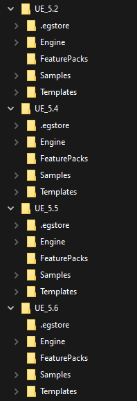
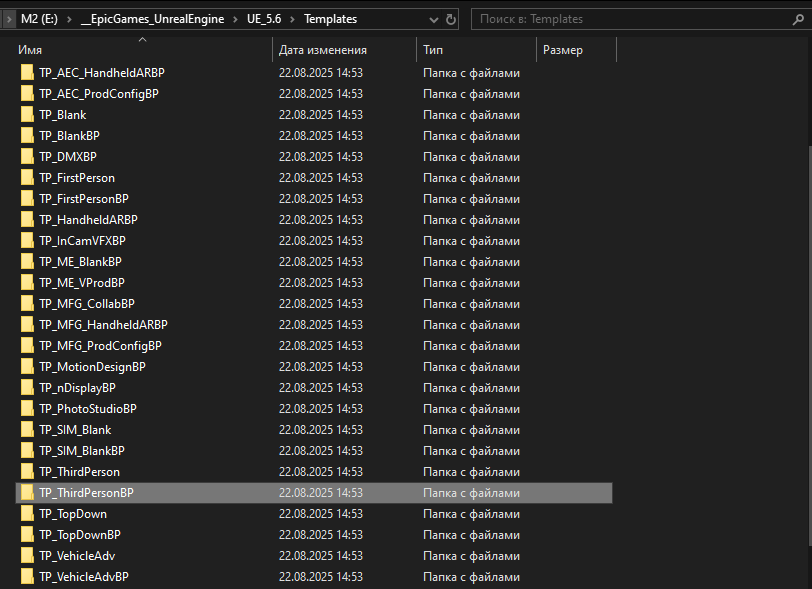
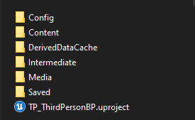
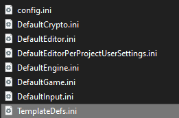
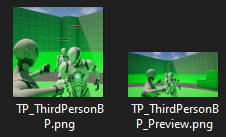
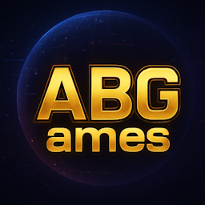
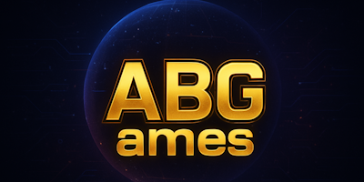
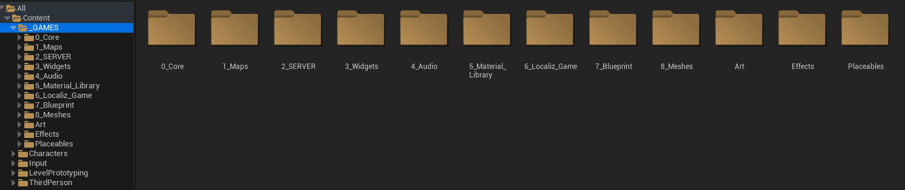
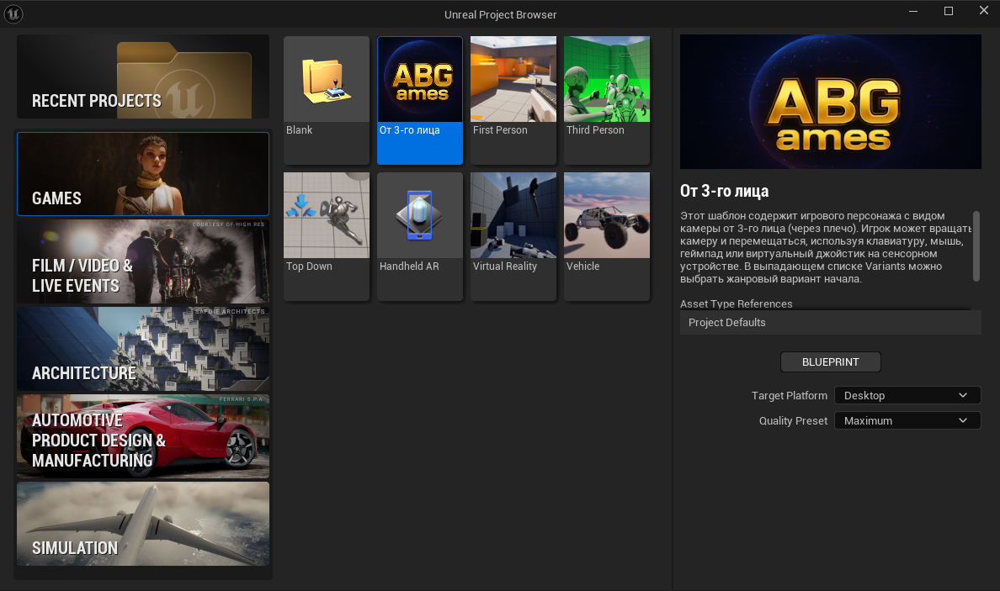

## 📘 Вводная информация

Все шаблоны (`Templates`), независимо от версии Unreal Engine, хранятся в одном и том же месте:

```text
\UE_5.6\Templates
```



---

Переходим в `Templates` — здесь находятся готовые шаблоны проектов от **Epic Games**.



---

Для примера возьмём готовый проект из папки `TP_ThirdPersonBP` и скопируем её.


---

После копирования переименовываем папку, например, в `TP_ABGames`.


---

Переходим в созданную нами папку:



---

Внутри нас интересуют папки `Media` и `Config`.

- В папке **Config** находится файл `TemplateDefs.ini`, в котором хранятся настройки шаблона для Unreal Engine.



---

## 🖼️ Переделываем изображения

В папке **Media** нужно заменить два изображения на свои.



Пример:

| Тип | Изображение | Размер |
|:----|:-------------:|:-------------:|
| Иконка |  | 256×256 |
| Превью |  | 400×200 |

---

## ⚙️ Настраиваем `TemplateDefs.ini`

Переходим в папку `Config` и открываем файл [`TemplateDefs.ini`](../../media/Tutorial/TemplateDefs.ini) в любом текстовом редакторе.  
Заменяем содержимое на следующий шаблон:

```ini
[/Script/GameProjectGeneration.TemplateProjectDefs]

Categories=Games

LocalizedDisplayNames=(Language="en",Text="От 3-го лица")
LocalizedDescriptions=(Language="en",Text="Этот шаблон содержит игрового персонажа с видом камеры от 3-го лица (через плечо). Игрок может вращать камеру и перемещаться, используя клавиатуру, мышь, геймпад или виртуальный джойстик на сенсорном устройстве. В выпадающем списке Variants можно выбрать жанровый вариант начала.")

bThumbnailAsIcon=true

ClassTypes=Character, SpringArmComponent, PlayerController, GameMode
AssetTypes=Animation Sequence, Animation Blueprint, Skeleton, Skeletal Mesh, Control Rig

FoldersToIgnore=Binaries
FoldersToIgnore=Build
FoldersToIgnore=Intermediate
FoldersToIgnore=Saved
FoldersToIgnore=Media

FilesToIgnore="%TEMPLATENAME%.uproject"
FilesToIgnore="%TEMPLATENAME%.png"
FilesToIgnore="Config/TemplateDefs.ini"
FilesToIgnore="Config/config.ini"
FilesToIgnore="Manifest.json"
FilesToIgnore="contents.txt"

FolderRenames=(From="Source/%TEMPLATENAME%",To="Source/%PROJECTNAME%")
FolderRenames=(From="Source/%TEMPLATENAME%Editor",To="Source/%PROJECTNAME%Editor")

FilenameReplacements=(Extensions=("cpp","h","ini","cs"),From="%TEMPLATENAME_UPPERCASE%",To="%PROJECTNAME_UPPERCASE%",bCaseSensitive=true)
FilenameReplacements=(Extensions=("cpp","h","ini","cs"),From="%TEMPLATENAME_LOWERCASE%",To="%PROJECTNAME_LOWERCASE%",bCaseSensitive=true)
FilenameReplacements=(Extensions=("cpp","h","ini","cs"),From="%TEMPLATENAME%",To="%PROJECTNAME%",bCaseSensitive=false)

ReplacementsInFiles=(Extensions=("cpp","h","ini","cs"),From="%TEMPLATENAME_UPPERCASE%",To="%PROJECTNAME_UPPERCASE%",bCaseSensitive=true)
ReplacementsInFiles=(Extensions=("cpp","h","ini","cs"),From="%TEMPLATENAME_LOWERCASE%",To="%PROJECTNAME_LOWERCASE%",bCaseSensitive=true)
ReplacementsInFiles=(Extensions=("cpp","h","ini","cs"),From="%TEMPLATENAME%",To="%PROJECTNAME%",bCaseSensitive=false)

SharedContentPacks=(MountName="LevelPrototyping",DetailLevels=("High"))
SharedContentPacks=(MountName="Characters",DetailLevels=("High"))
SharedContentPacks=(MountName="Input",DetailLevels=("High"))
EditDetailLevelPreference="High"
```

---

## 🧩 Кастомизация проекта

Запускаем исполняемый файл `TP_ThirdPersonBP.uproject` нашего шаблона.


После открытия проекта вносим необходимые изменения, сохраняем и закрываем его.



Теперь запускаем нужную версию движка, выбираем созданный шаблон — и приступаем к разработке.



---

## 🏁 Итог

В результате мы получили **свой собственный шаблон** (Template) для Unreal Engine, который можно использовать для тестов и новых проектов — с уже настроенным окружением, структурой и контентом.  
Создаётся один раз, а экономит время постоянно 🚀
